# ANU — Easy-to-read click flowcharts

Each box says what you click and what you see next. Side branches explain mistakes, Cancel and other choices. Read one task at a time.

These flows follow the current project source. Features that are unfinished or cannot be confirmed are labelled. Menus and available buttons depend on your account role.

Cloud notes describe where charges arise. They are not a fixed price for each click. The earlier cloud-cost guide contains the billing formulas and sources.

## 1. Sign in

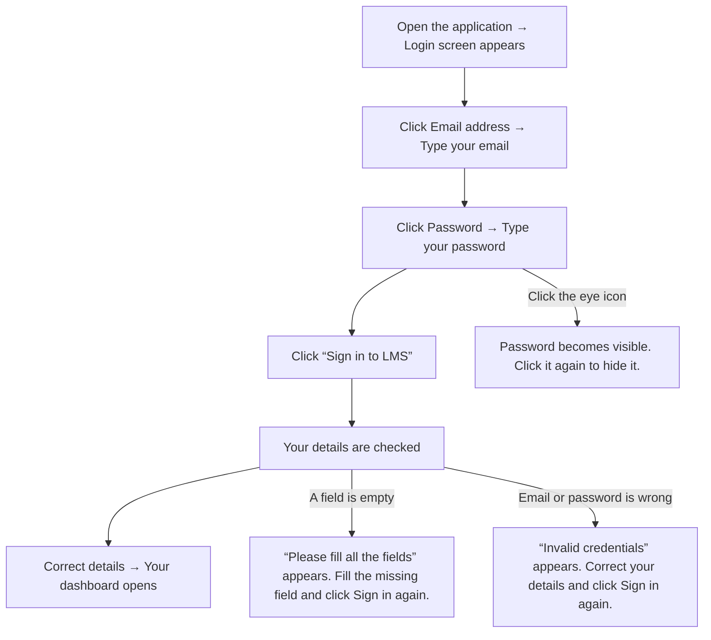
```mermaid
flowchart TD
    S0["Open the application → Login screen appears"]
    S1["Click Email address → Type your email"]
    S0 --> S1
    S2["Click Password → Type your password"]
    S1 --> S2
    S3["Click “Sign in to LMS”"]
    S2 --> S3
    S4["Your details are checked"]
    S3 --> S4
    S5["Correct details → Your dashboard opens"]
    S4 --> S5
    S2 -->|"Click the eye icon"| B0["Password becomes visible. Click it again to hide it."]
    S4 -->|"A field is empty"| B1["“Please fill all the fields” appears. Fill the missing field and click Sign in again."]
    S4 -->|"Email or password is wrong"| B2["“Invalid credentials” appears. Correct your details and click Sign in again."]
```

**Cloud cost here:** At Sign in: the cloud checks your account and saves the login session. Cost comes from the number of checks and the time the server runs.

## 2. Forgot password

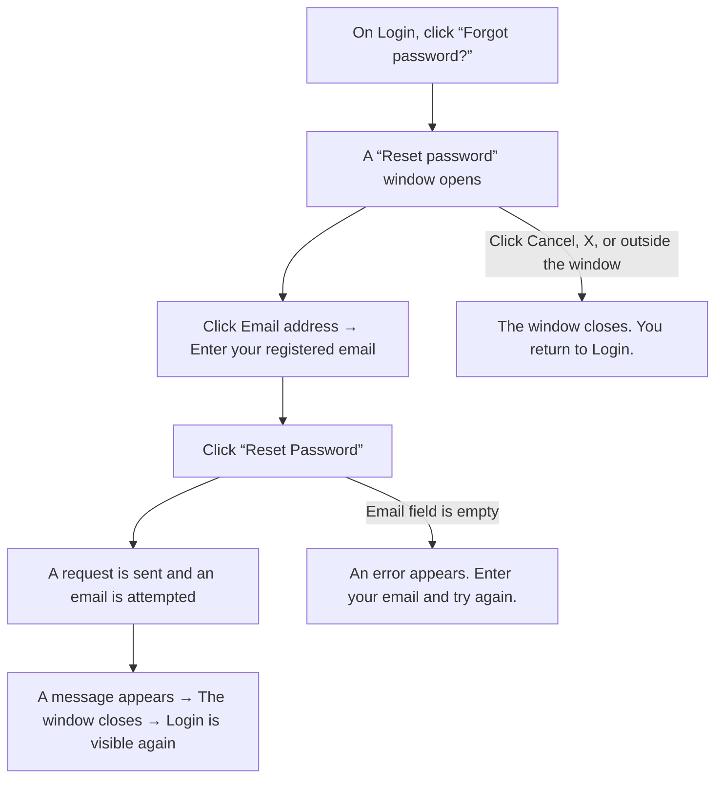
```mermaid
flowchart TD
    S0["On Login, click “Forgot password?”"]
    S1["A “Reset password” window opens"]
    S0 --> S1
    S2["Click Email address → Enter your registered email"]
    S1 --> S2
    S3["Click “Reset Password”"]
    S2 --> S3
    S4["A request is sent and an email is attempted"]
    S3 --> S4
    S5["A message appears → The window closes → Login is visible again"]
    S4 --> S5
    S1 -->|"Click Cancel, X, or outside the window"| B0["The window closes. You return to Login."]
    S3 -->|"Email field is empty"| B1["An error appears. Enter your email and try again."]
```

**Cloud cost here:** At Reset Password: the cloud records the request and sends an email. Charges depend on server usage and the email provider.

**Current project note:** Needs completion: the current email contains placeholder text. A working reset link, new-password screen and phone-based password recovery are not completed in this flow.

## 3. Verify an account / resend OTP

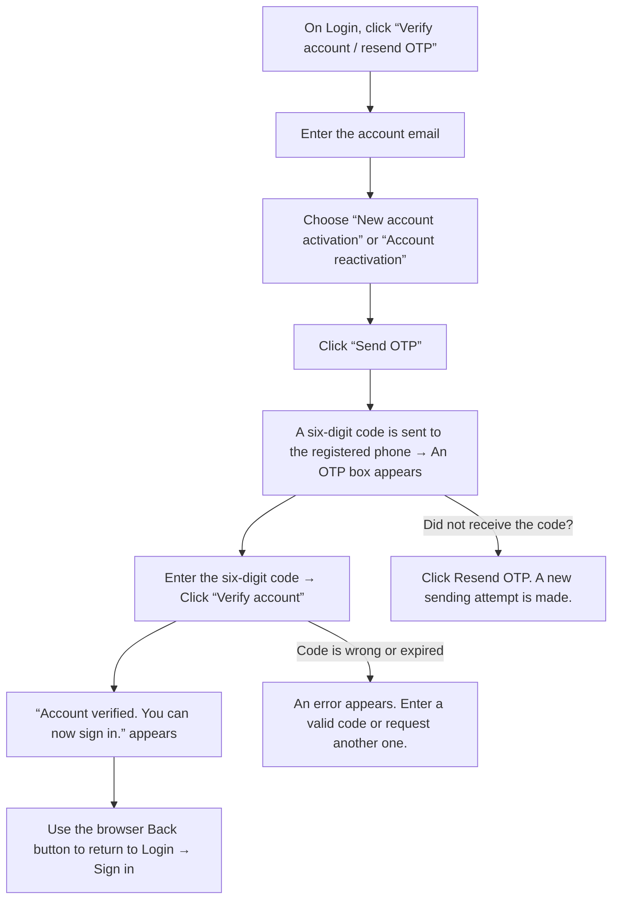
```mermaid
flowchart TD
    S0["On Login, click “Verify account / resend OTP”"]
    S1["Enter the account email"]
    S0 --> S1
    S2["Choose “New account activation” or “Account reactivation”"]
    S1 --> S2
    S3["Click “Send OTP”"]
    S2 --> S3
    S4["A six-digit code is sent to the registered phone → An OTP box appears"]
    S3 --> S4
    S5["Enter the six-digit code → Click “Verify account”"]
    S4 --> S5
    S6["“Account verified. You can now sign in.” appears"]
    S5 --> S6
    S7["Use the browser Back button to return to Login → Sign in"]
    S6 --> S7
    S4 -->|"Did not receive the code?"| B0["Click Resend OTP. A new sending attempt is made."]
    S5 -->|"Code is wrong or expired"| B1["An error appears. Enter a valid code or request another one."]
```

**Cloud cost here:** At Send / Resend OTP: notification-provider charges may apply. At Verify account: the saved account is checked and updated.

**Current project note:** This verifies account activation/reactivation. It is separate from resetting a forgotten password.

## 4. Open another screen

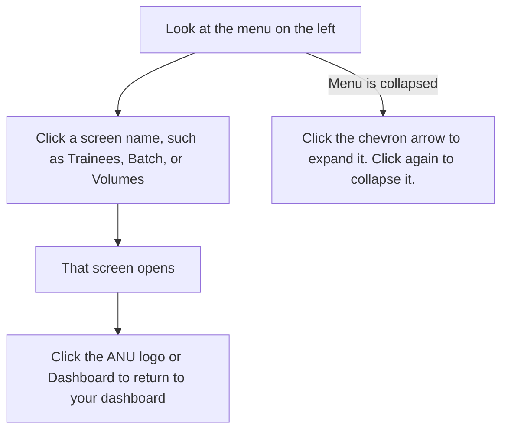
```mermaid
flowchart TD
    S0["Look at the menu on the left"]
    S1["Click a screen name, such as Trainees, Batch, or Volumes"]
    S0 --> S1
    S2["That screen opens"]
    S1 --> S2
    S3["Click the ANU logo or Dashboard to return to your dashboard"]
    S2 --> S3
    S0 -->|"Menu is collapsed"| B0["Click the chevron arrow to expand it. Click again to collapse it."]
```

**Cloud cost here:** Changing the menu itself is local. Opening a screen may read saved cloud data.

**Current project note:** The visible menu depends on whether you are a trainee, instructor, institution admin or super admin.

## 5. Notifications

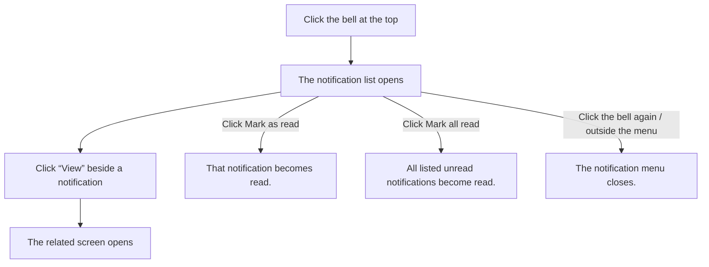
```mermaid
flowchart TD
    S0["Click the bell at the top"]
    S1["The notification list opens"]
    S0 --> S1
    S2["Click “View” beside a notification"]
    S1 --> S2
    S3["The related screen opens"]
    S2 --> S3
    S1 -->|"Click Mark as read"| B0["That notification becomes read."]
    S1 -->|"Click Mark all read"| B1["All listed unread notifications become read."]
    S1 -->|"Click the bell again / outside the menu"| B2["The notification menu closes."]
```

**Cloud cost here:** Reading or updating saved notifications uses cloud data. It does not upload headset video.

## 6. View profile / manage sessions / log out

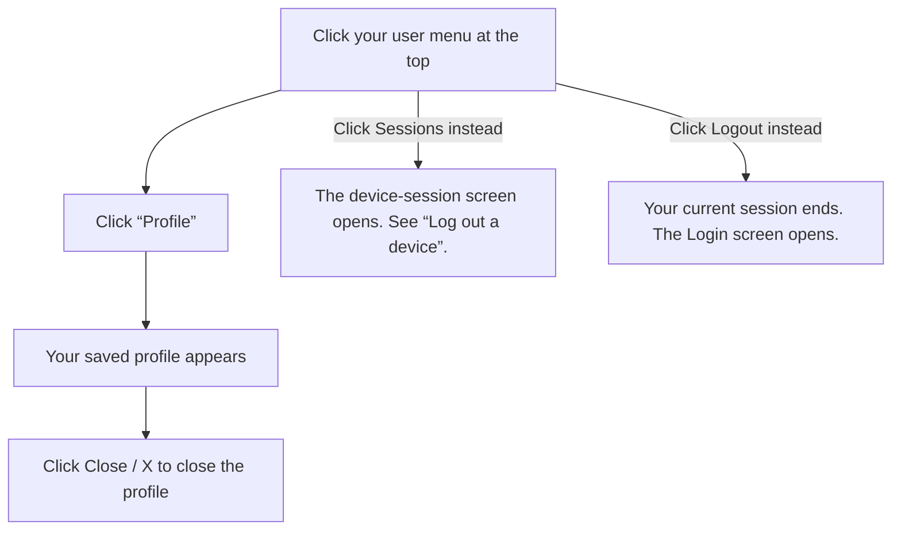
```mermaid
flowchart TD
    S0["Click your user menu at the top"]
    S1["Click “Profile”"]
    S0 --> S1
    S2["Your saved profile appears"]
    S1 --> S2
    S3["Click Close / X to close the profile"]
    S2 --> S3
    S0 -->|"Click Sessions instead"| B0["The device-session screen opens. See “Log out a device”."]
    S0 -->|"Click Logout instead"| B1["Your current session ends. The Login screen opens."]
```

**Cloud cost here:** Opening a profile may read saved cloud data. Logout updates your saved session.

## 7. Fullscreen, table pages and search

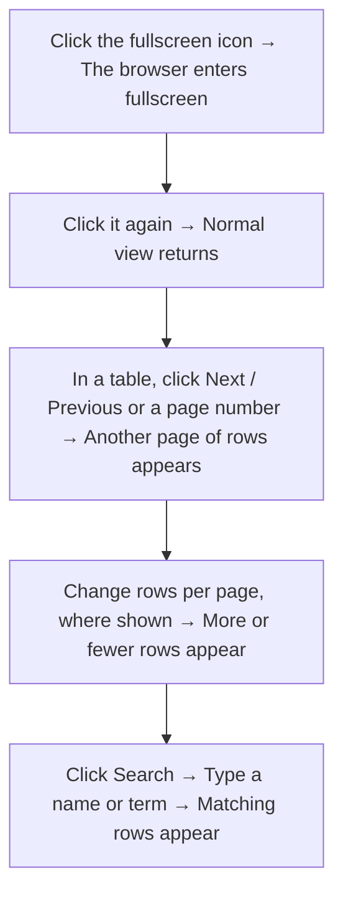
```mermaid
flowchart TD
    S0["Click the fullscreen icon → The browser enters fullscreen"]
    S1["Click it again → Normal view returns"]
    S0 --> S1
    S2["In a table, click Next / Previous or a page number → Another page of rows appears"]
    S1 --> S2
    S3["Change rows per page, where shown → More or fewer rows appear"]
    S2 --> S3
    S4["Click Search → Type a name or term → Matching rows appear"]
    S3 --> S4
```

**Cloud cost here:** Fullscreen is local. Table/search controls may work on already-loaded rows or request another set of cloud data, depending on the screen.

## 8. Use your dashboard

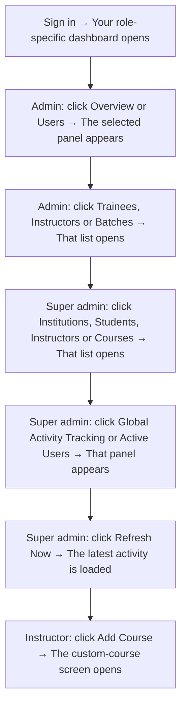
```mermaid
flowchart TD
    S0["Sign in → Your role-specific dashboard opens"]
    S1["Admin: click Overview or Users → The selected panel appears"]
    S0 --> S1
    S2["Admin: click Trainees, Instructors or Batches → That list opens"]
    S1 --> S2
    S3["Super admin: click Institutions, Students, Instructors or Courses → That list opens"]
    S2 --> S3
    S4["Super admin: click Global Activity Tracking or Active Users → That panel appears"]
    S3 --> S4
    S5["Super admin: click Refresh Now → The latest activity is loaded"]
    S4 --> S5
    S6["Instructor: click Add Course → The custom-course screen opens"]
    S5 --> S6
```

**Cloud cost here:** Dashboard data and refreshes read saved cloud information. Switching a panel may use information already loaded.

**Current project note:** These are separate role-specific choices. One person will not see all of them.

## 9. Add a trainee — personal details

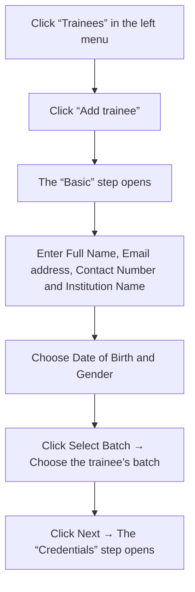
```mermaid
flowchart TD
    S0["Click “Trainees” in the left menu"]
    S1["Click “Add trainee”"]
    S0 --> S1
    S2["The “Basic” step opens"]
    S1 --> S2
    S3["Enter Full Name, Email address, Contact Number and Institution Name"]
    S2 --> S3
    S4["Choose Date of Birth and Gender"]
    S3 --> S4
    S5["Click Select Batch → Choose the trainee’s batch"]
    S4 --> S5
    S6["Click Next → The “Credentials” step opens"]
    S5 --> S6
```

**Cloud cost here:** The batch choices are read from saved data. Typing these details does not save the trainee yet.

## 10. Add a trainee — password, photo and save

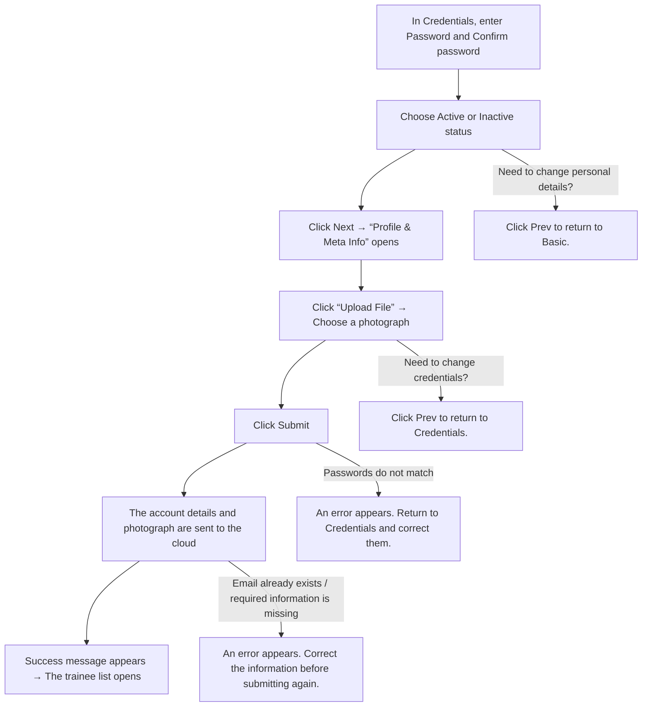
```mermaid
flowchart TD
    S0["In Credentials, enter Password and Confirm password"]
    S1["Choose Active or Inactive status"]
    S0 --> S1
    S2["Click Next → “Profile & Meta Info” opens"]
    S1 --> S2
    S3["Click “Upload File” → Choose a photograph"]
    S2 --> S3
    S4["Click Submit"]
    S3 --> S4
    S5["The account details and photograph are sent to the cloud"]
    S4 --> S5
    S6["Success message appears → The trainee list opens"]
    S5 --> S6
    S1 -->|"Need to change personal details?"| B0["Click Prev to return to Basic."]
    S3 -->|"Need to change credentials?"| B1["Click Prev to return to Credentials."]
    S4 -->|"Passwords do not match"| B2["An error appears. Return to Credentials and correct them."]
    S5 -->|"Email already exists / required information is missing"| B3["An error appears. Correct the information before submitting again."]
```

**Cloud cost here:** At Submit: account details are stored in the database; the photo is sent with the form. File storage and verification-message costs depend on the server path used.

## 11. Add an instructor

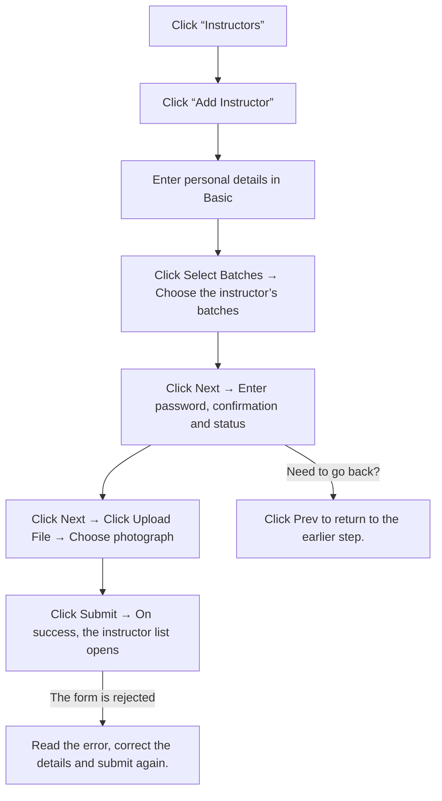
```mermaid
flowchart TD
    S0["Click “Instructors”"]
    S1["Click “Add Instructor”"]
    S0 --> S1
    S2["Enter personal details in Basic"]
    S1 --> S2
    S3["Click Select Batches → Choose the instructor’s batches"]
    S2 --> S3
    S4["Click Next → Enter password, confirmation and status"]
    S3 --> S4
    S5["Click Next → Click Upload File → Choose photograph"]
    S4 --> S5
    S6["Click Submit → On success, the instructor list opens"]
    S5 --> S6
    S4 -->|"Need to go back?"| B0["Click Prev to return to the earlier step."]
    S6 -->|"The form is rejected"| B1["Read the error, correct the details and submit again."]
```

**Cloud cost here:** At Submit: cloud account creation, submitted photo handling and any verification message may incur usage.

## 12. View or edit a trainee

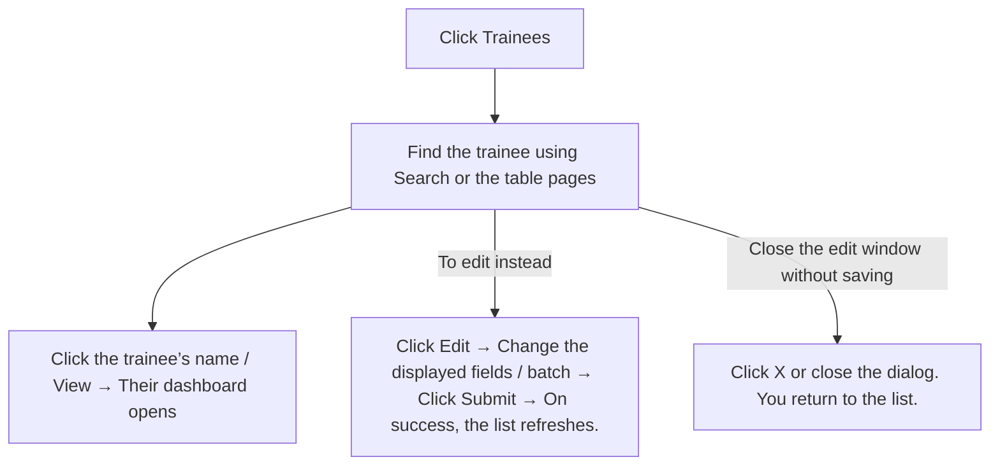
```mermaid
flowchart TD
    S0["Click Trainees"]
    S1["Find the trainee using Search or the table pages"]
    S0 --> S1
    S2["Click the trainee’s name / View → Their dashboard opens"]
    S1 --> S2
    S1 -->|"To edit instead"| B0["Click Edit → Change the displayed fields / batch → Click Submit → On success, the list refreshes."]
    S1 -->|"Close the edit window without saving"| B1["Click X or close the dialog. You return to the list."]
```

**Cloud cost here:** View reads saved results. Submit saves account changes in the cloud.

## 13. Enable, disable or delete a trainee

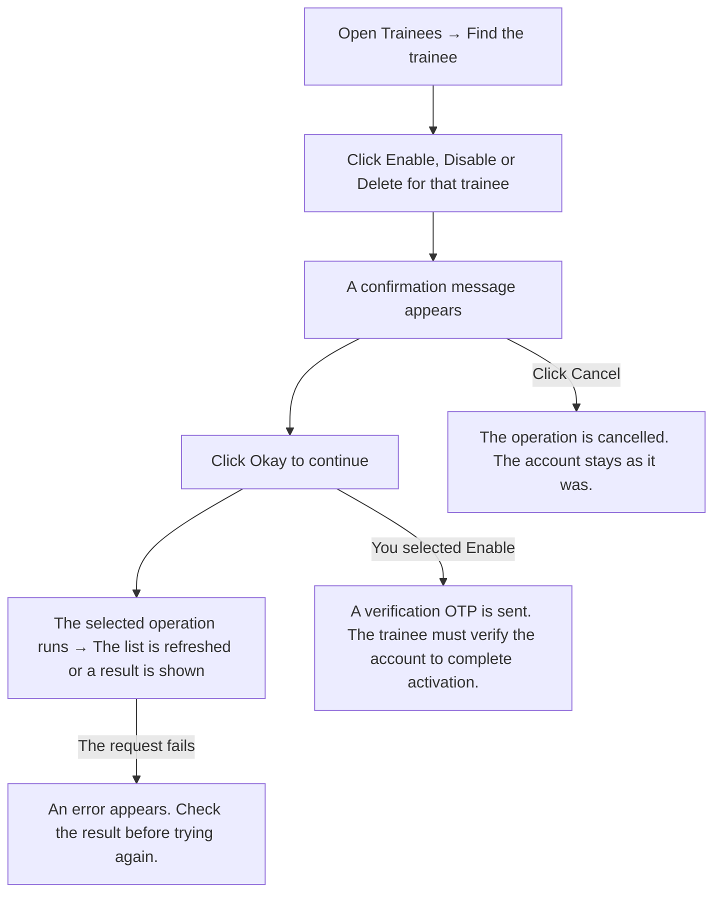
```mermaid
flowchart TD
    S0["Open Trainees → Find the trainee"]
    S1["Click Enable, Disable or Delete for that trainee"]
    S0 --> S1
    S2["A confirmation message appears"]
    S1 --> S2
    S3["Click Okay to continue"]
    S2 --> S3
    S4["The selected operation runs → The list is refreshed or a result is shown"]
    S3 --> S4
    S2 -->|"Click Cancel"| B0["The operation is cancelled. The account stays as it was."]
    S3 -->|"You selected Enable"| B1["A verification OTP is sent. The trainee must verify the account to complete activation."]
    S4 -->|"The request fails"| B2["An error appears. Check the result before trying again."]
```

**Cloud cost here:** At Okay: the saved account is updated or deleted. Enable may also send a paid verification message.

## 14. View, edit or delete an instructor

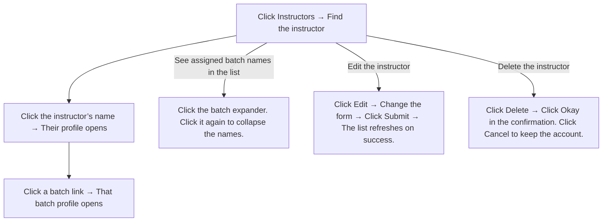
```mermaid
flowchart TD
    S0["Click Instructors → Find the instructor"]
    S1["Click the instructor’s name → Their profile opens"]
    S0 --> S1
    S2["Click a batch link → That batch profile opens"]
    S1 --> S2
    S0 -->|"See assigned batch names in the list"| B0["Click the batch expander. Click it again to collapse the names."]
    S0 -->|"Edit the instructor"| B1["Click Edit → Change the form → Click Submit → The list refreshes on success."]
    S0 -->|"Delete the instructor"| B2["Click Delete → Click Okay in the confirmation. Click Cancel to keep the account."]
```

**Cloud cost here:** Viewing reads cloud information. Saving or confirming deletion changes saved account data.

## 15. Create a batch

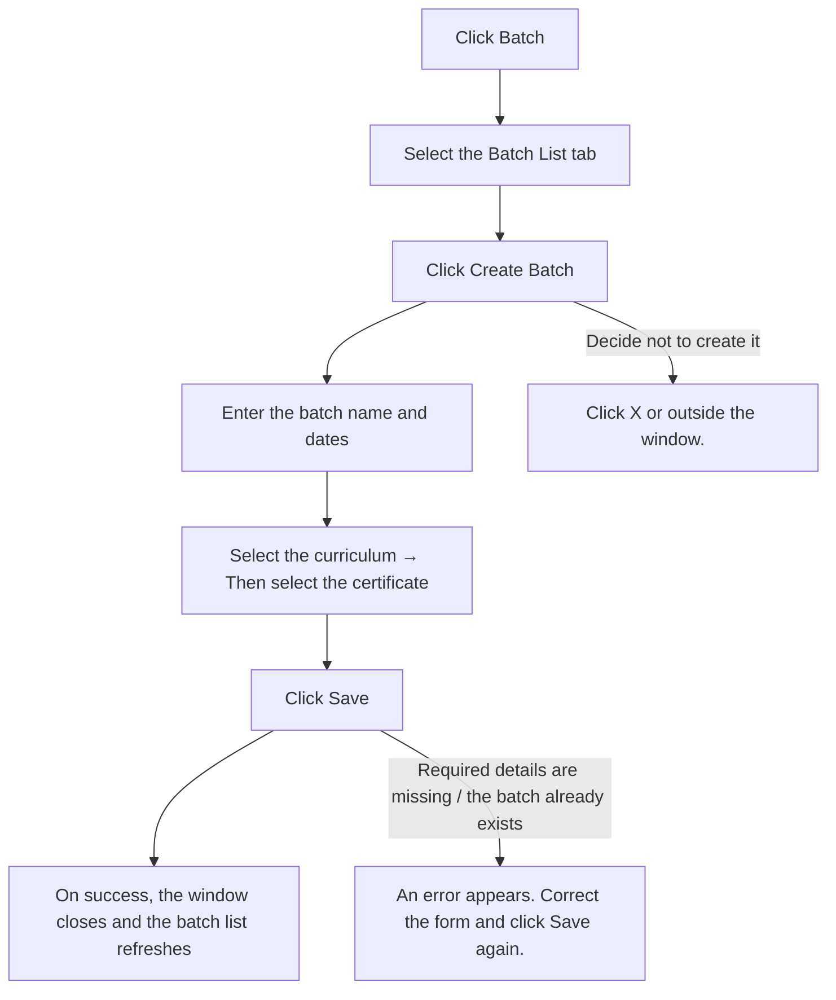
```mermaid
flowchart TD
    S0["Click Batch"]
    S1["Select the Batch List tab"]
    S0 --> S1
    S2["Click Create Batch"]
    S1 --> S2
    S3["Enter the batch name and dates"]
    S2 --> S3
    S4["Select the curriculum → Then select the certificate"]
    S3 --> S4
    S5["Click Save"]
    S4 --> S5
    S6["On success, the window closes and the batch list refreshes"]
    S5 --> S6
    S5 -->|"Required details are missing / the batch already exists"| B0["An error appears. Correct the form and click Save again."]
    S2 -->|"Decide not to create it"| B1["Click X or outside the window."]
```

**Cloud cost here:** At Save: batch information is stored in the cloud. Curriculum and certificate choices also read saved data.

## 16. Find, open, edit or delete a batch

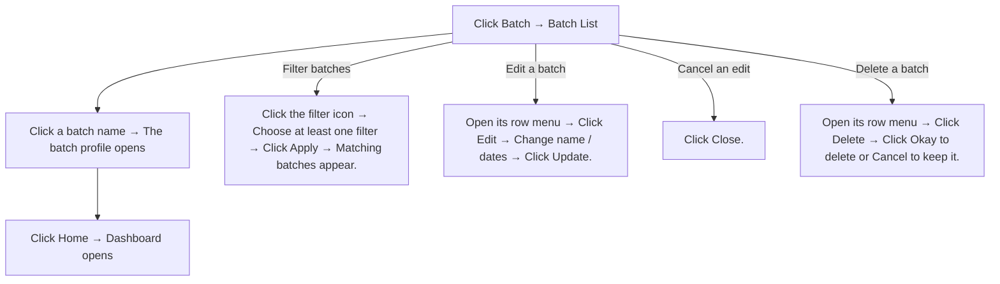
```mermaid
flowchart TD
    S0["Click Batch → Batch List"]
    S1["Click a batch name → The batch profile opens"]
    S0 --> S1
    S2["Click Home → Dashboard opens"]
    S1 --> S2
    S0 -->|"Filter batches"| B0["Click the filter icon → Choose at least one filter → Click Apply → Matching batches appear."]
    S0 -->|"Edit a batch"| B1["Open its row menu → Click Edit → Change name / dates → Click Update."]
    S0 -->|"Cancel an edit"| B2["Click Close."]
    S0 -->|"Delete a batch"| B3["Open its row menu → Click Delete → Click Okay to delete or Cancel to keep it."]
```

**Cloud cost here:** Opening/filtering reads cloud data. Update and confirmed deletion change saved batch data.

**Current project note:** Some sort icons in the batch profile have no sorting action connected.

## 17. Create targeted learning

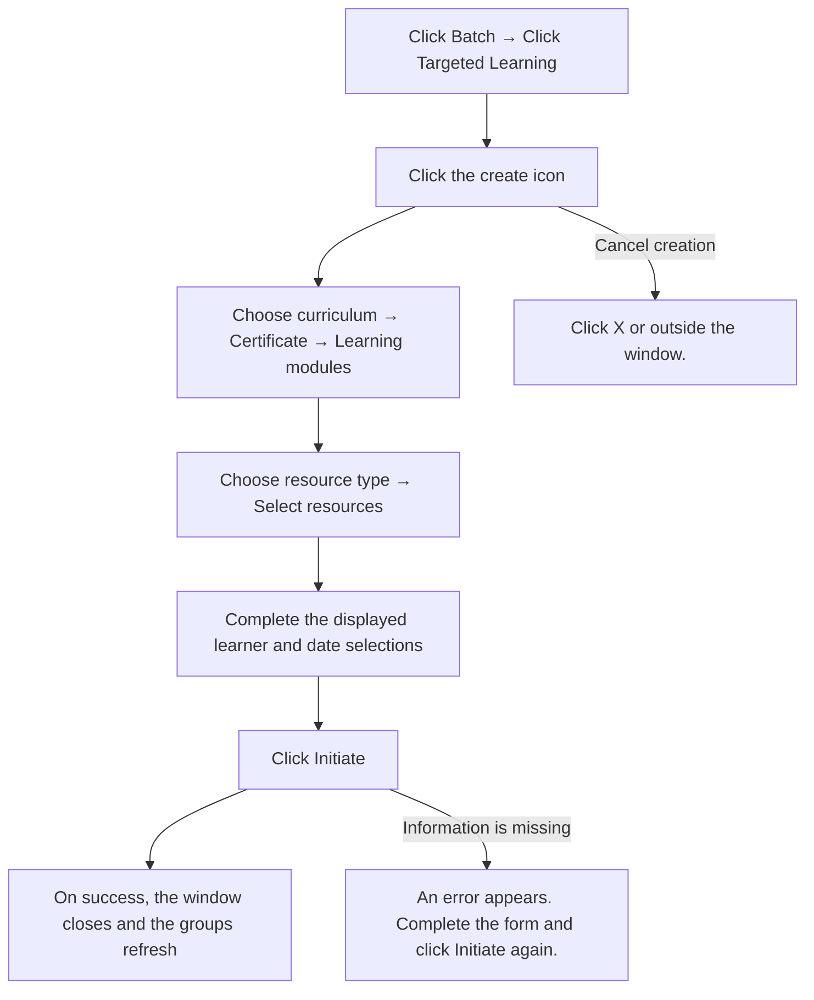
```mermaid
flowchart TD
    S0["Click Batch → Click Targeted Learning"]
    S1["Click the create icon"]
    S0 --> S1
    S2["Choose curriculum → Certificate → Learning modules"]
    S1 --> S2
    S3["Choose resource type → Select resources"]
    S2 --> S3
    S4["Complete the displayed learner and date selections"]
    S3 --> S4
    S5["Click Initiate"]
    S4 --> S5
    S6["On success, the window closes and the groups refresh"]
    S5 --> S6
    S5 -->|"Information is missing"| B0["An error appears. Complete the form and click Initiate again."]
    S1 -->|"Cancel creation"| B1["Click X or outside the window."]
```

**Cloud cost here:** Choices read saved cloud data. Initiate stores the targeted learning assignment.

## 18. Open or delete targeted learning

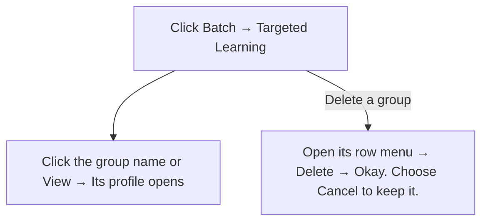
```mermaid
flowchart TD
    S0["Click Batch → Targeted Learning"]
    S1["Click the group name or View → Its profile opens"]
    S0 --> S1
    S0 -->|"Delete a group"| B0["Open its row menu → Delete → Okay. Choose Cancel to keep it."]
```

**Cloud cost here:** Opening reads saved group information. Confirmed deletion removes the saved assignment.

## 19. Use the schedule

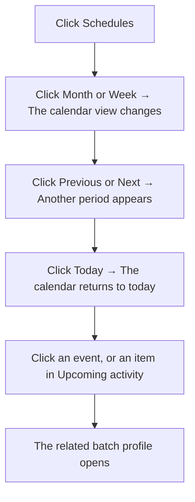
```mermaid
flowchart TD
    S0["Click Schedules"]
    S1["Click Month or Week → The calendar view changes"]
    S0 --> S1
    S2["Click Previous or Next → Another period appears"]
    S1 --> S2
    S3["Click Today → The calendar returns to today"]
    S2 --> S3
    S4["Click an event, or an item in Upcoming activity"]
    S3 --> S4
    S5["The related batch profile opens"]
    S4 --> S5
```

**Cloud cost here:** Loading schedules and opening the batch read saved cloud data. Moving the displayed calendar period is a view action.

## 20. Create a curriculum

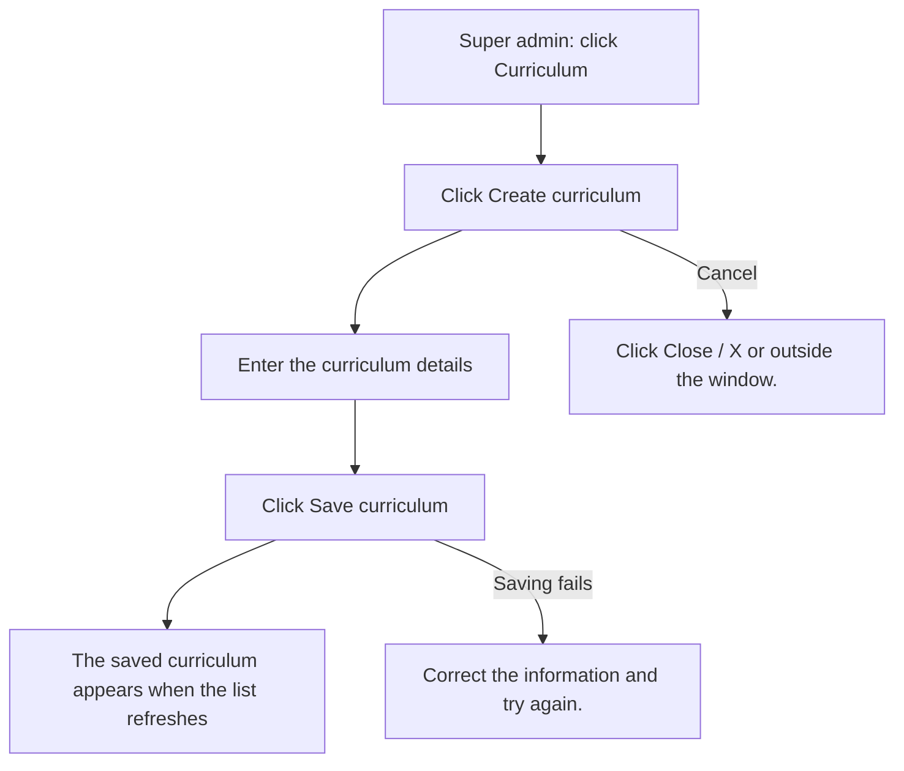
```mermaid
flowchart TD
    S0["Super admin: click Curriculum"]
    S1["Click Create curriculum"]
    S0 --> S1
    S2["Enter the curriculum details"]
    S1 --> S2
    S3["Click Save curriculum"]
    S2 --> S3
    S4["The saved curriculum appears when the list refreshes"]
    S3 --> S4
    S1 -->|"Cancel"| B0["Click Close / X or outside the window."]
    S3 -->|"Saving fails"| B1["Correct the information and try again."]
```

**Cloud cost here:** At Save curriculum: the new curriculum is written to cloud data.

## 21. Use a curriculum’s menu

```mermaid
flowchart TD
    S0["Click Curriculum"]
    S1["Open the Actions menu for a curriculum"]
    S0 --> S1
    S2["Click View or Add course → The Certifications list opens"]
    S1 --> S2
    S1 -->|"Click Tag trainees"| B0["The Trainees list opens."]
    S1 -->|"Click Tag instructors"| B1["The Instructors list opens."]
    S1 -->|"Click Delete"| B2["A confirmation appears. Okay deletes it; Cancel keeps it."]
```

**Cloud cost here:** Opening lists reads saved data. Confirming Delete changes cloud data.

## 22. Create, open or delete a certification

```mermaid
flowchart TD
    S0["Click Certifications"]
    S1["Click Add Course"]
    S0 --> S1
    S2["Enter the name and choose the curriculum"]
    S1 --> S2
    S3["Click Save"]
    S2 --> S3
    S4["The certification list refreshes"]
    S3 --> S4
    S5["Click a certification name or View → Its learning modules open"]
    S4 --> S5
    S1 -->|"Cancel creation"| B0["Click X / outside the window."]
    S0 -->|"Expand a list row"| B1["Click its arrow / expandable label; click again to collapse it."]
    S0 -->|"Delete a certification"| B2["Open the row menu → Delete → Okay. Choose Cancel to keep it."]
    S0 -->|"Tag a course"| B3["Open the row menu → Tag Course → Choose associations → Save."]
```

**Cloud cost here:** Save, Tag Course and confirmed Delete change saved cloud data. Opening a certification reads its content.

## 23. Open modules, topics and resources

```mermaid
flowchart TD
    S0["Open a certification"]
    S1["Click the arrow beside a learning module"]
    S0 --> S1
    S2["The module’s resource categories appear"]
    S1 --> S2
    S3["Click a category → Its resources appear"]
    S2 --> S3
    S4["If a topic is grouped, click its arrow → Its resources appear"]
    S3 --> S4
    S5["Click a resource row → A learner-completion window opens"]
    S4 --> S5
    S6["Click View Profile beside a learner → Their dashboard opens"]
    S5 --> S6
    S1 -->|"Hide the module again"| B0["Click the same arrow."]
    S3 -->|"Hide a category / topic"| B1["Click its arrow again."]
    S5 -->|"Return to the resources"| B2["Click X or outside the completion window."]
```

**Cloud cost here:** Opening content or learner-completion details reads saved cloud data. Expand / collapse actions themselves are local.

## 24. Create a learning module

```mermaid
flowchart TD
    S0["Open a certification"]
    S1["Click the add learning-module icon"]
    S0 --> S1
    S2["Choose the certification and complete the course, module and unit fields"]
    S1 --> S2
    S3["Click Create"]
    S2 --> S3
    S4["On success, the new learning module is available in the refreshed view"]
    S3 --> S4
    S1 -->|"Cancel"| B0["Click X / outside the window."]
    S3 -->|"Creation fails"| B1["Correct the form and try again."]
```

**Cloud cost here:** At Create: learning-module information is stored in the cloud.

## 25. Create a resource

```mermaid
flowchart TD
    S0["Open a certification → Expand its learning module"]
    S1["Click the add-resource icon"]
    S0 --> S1
    S2["Choose the resource type"]
    S1 --> S2
    S3["Complete the fields shown for that resource type"]
    S2 --> S3
    S4["Click Create"]
    S3 --> S4
    S5["On success, the resource list refreshes"]
    S4 --> S5
    S1 -->|"Cancel"| B0["Click X / outside the window."]
    S4 -->|"Creation fails"| B1["Correct the information and click Create again."]
```

**Cloud cost here:** At Create: the resource details are stored in the cloud.

## 26. Attach a volume to a resource

```mermaid
flowchart TD
    S0["Open the certification → Expand the module and resource category"]
    S1["Click Attach Volume beside the resource"]
    S0 --> S1
    S2["Select Volume Name"]
    S1 --> S2
    S3["The available Shadow Recording and Step Recording choices load"]
    S2 --> S3
    S4["Choose the applicable recordings"]
    S3 --> S4
    S5["Click Attach"]
    S4 --> S5
    S6["On success, the window closes and the volume is linked to the resource"]
    S5 --> S6
    S1 -->|"Cancel"| B0["Click Cancel / X or outside the window."]
    S5 -->|"Attachment fails"| B1["An error appears. Correct the selections and try again."]
```

**Cloud cost here:** Selecting a volume reads recording information. Attach saves the link. It does not upload the whole volume again.

## 27. Add or edit questions

```mermaid
flowchart TD
    S0["Click the question-editor icon beside the resource"]
    S1["Choose the question type and enter its number / prompt"]
    S0 --> S1
    S2["Complete the fields shown for that question type"]
    S1 --> S2
    S3["Click Add Option or Add Step to add a row"]
    S2 --> S3
    S4["Enter the option / step details and choose the correct answer where applicable"]
    S3 --> S4
    S5["Click Add Question to add another question"]
    S4 --> S5
    S6["Click Save Questions → The configured questions are saved"]
    S5 --> S6
    S2 -->|"Add an image"| B0["Use the image file selector, where shown, or enter its image address."]
    S3 -->|"Remove an option / step"| B1["Click its remove icon."]
    S5 -->|"Remove a question"| B2["Click that question’s delete icon."]
    S0 -->|"Close the editor"| B3["Click X / close the dialog."]
    S6 -->|"Validation or saving fails"| B4["Read the error, correct the fields and save again."]
```

**Cloud cost here:** Save Questions stores question data. Uploading an image adds file-storage usage. Merely adding/removing an unsaved form row is local.

## 28. Alternate Chapter → Module → Resource screens

```mermaid
flowchart TD
    S0["On Chapters, click a chapter → Its modules appear"]
    S1["On Modules, click a module → Its resources appear"]
    S0 --> S1
    S2["Click the add icon on the relevant screen"]
    S1 --> S2
    S3["Enter the chapter, module or resource details"]
    S2 --> S3
    S4["Click Save → The corresponding creation request runs"]
    S3 --> S4
    S2 -->|"Cancel"| B0["Click X / close."]
    S1 -->|"Edit resource questions"| B1["Click the question icon beside the resource."]
```

**Cloud cost here:** Save stores the corresponding content record.

**Current project note:** The old Course breadcrumb points to an unregistered destination. The current source can send the user back to Login through that link.

## 29. Create and publish an accessible course

```mermaid
flowchart TD
    S0["Open Content Access"]
    S1["Click Create course"]
    S0 --> S1
    S2["Complete the course form → Click Create draft"]
    S1 --> S2
    S3["The new course appears as a draft"]
    S2 --> S3
    S4["Click Publish beside that course"]
    S3 --> S4
    S5["The course state changes and the list reloads"]
    S4 --> S5
    S1 -->|"Cancel creation"| B0["Click the close control."]
    S3 -->|"Unpublish an existing course"| B1["Click Unpublish. The course returns to draft."]
    S3 -->|"Archive an existing course"| B2["Click Archive."]
```

**Cloud cost here:** Create draft and changing the publication state update cloud data.

**Current project note:** Only users with the relevant permissions see these controls.

## 30. Choose who can see or use a course

```mermaid
flowchart TD
    S0["Open Content Access → Find the course"]
    S1["Change its institution-visibility choices"]
    S0 --> S1
    S2["Click Save visibility → The institution access is saved"]
    S1 --> S2
    S3["Click Assignments → The assignment window opens"]
    S2 --> S3
    S4["Choose the displayed batches / users"]
    S3 --> S4
    S5["Click Save assignments"]
    S4 --> S5
    S6["On success, the assignment window closes"]
    S5 --> S6
    S3 -->|"Cancel assignments"| B0["Click the close control."]
    S0 -->|"Open the course instead"| B1["Click Open → Its certification details appear."]
```

**Cloud cost here:** Save visibility and Save assignments store access rules in the cloud.

## 31. Add administrators and review older content

```mermaid
flowchart TD
    S0["Open the permitted administrator section in Content Access"]
    S1["To add an institution admin: choose the institution → Fill details → Click Add"]
    S0 --> S1
    S2["To add a super admin: fill the super-admin form → Click Add Super Admin"]
    S1 --> S2
    S3["Returned account information appears → Click Dismiss to hide it"]
    S2 --> S3
    S4["For content awaiting review: choose Global core, Global specialized or Set institution"]
    S3 --> S4
    S5["For an older mapping: click the applicable Migrate choice"]
    S4 --> S5
```

**Cloud cost here:** Creating accounts and assigning ownership update cloud data. A verification message may add notification charges.

**Current project note:** These controls are restricted by role. Ownership/migration actions apply to existing content requiring review, not to an ordinary learner.

## 32. Upload a volume — enter details

```mermaid
flowchart TD
    S0["Click Volumes"]
    S1["Click Upload Volume"]
    S0 --> S1
    S2["Enter Volume Name and Anatomy Type"]
    S1 --> S2
    S3["Choose Fetal Presentation and Trimester"]
    S2 --> S3
    S4["Enter Gestational Age and Case Details"]
    S3 --> S4
    S5["Check the displayed Uploader Name"]
    S4 --> S5
    S6["Click the file-selection area → Your computer’s file picker opens"]
    S5 --> S6
    S1 -->|"Cancel"| B0["Click X / outside the upload window."]
```

**Cloud cost here:** No volume file is sent merely by opening this window or typing metadata.

## 33. Upload a volume — choose files and send

```mermaid
flowchart TD
    S0["In the file picker, choose the .vol file or files"]
    S1["The selected files appear in the upload window"]
    S0 --> S1
    S2["Click Upload"]
    S1 --> S2
    S3["The files are sent to cloud storage; their details are saved"]
    S2 --> S3
    S4["A success / upload-result message appears"]
    S3 --> S4
    S5["On success, the window closes and the volume list refreshes"]
    S4 --> S5
    S1 -->|"Wrong file selected"| B0["Click Remove file beside it → Select the correct file."]
    S2 -->|"Required details or files are missing"| B1["An error appears. Complete the form and click Upload again."]
    S3 -->|"A file fails to upload"| B2["Inspect the upload result before retrying, so already-uploaded files are not blindly sent again."]
```

**Cloud cost here:** At Upload: file capacity, upload requests and server processing are chargeable dimensions. Keeping the file in storage adds a monthly storage charge.

**Current project note:** The file picker allows up to ten .vol files. The backend also applies its configured file-size limit.

## 34. Filter, edit or convert a volume

```mermaid
flowchart TD
    S0["Click Volumes"]
    S1["Type in Search or choose the anatomy / approval / conversion filters"]
    S0 --> S1
    S2["Matching volume rows appear"]
    S1 --> S2
    S3["Open the selected volume’s row menu"]
    S2 --> S3
    S4["Click Edit → Change details → Click Save Changes"]
    S3 --> S4
    S5["Or click the conversion action → “Conversion Started” appears if accepted"]
    S4 --> S5
    S4 -->|"Cancel editing"| B0["Click Cancel / X."]
    S4 -->|"Saving fails"| B1["Read the error, correct the form and save again."]
    S5 -->|"Conversion request fails"| B2["An error appears. Check the volume state before retrying."]
```

**Cloud cost here:** Save Changes updates saved metadata. Starting conversion runs a cloud computer and creates a converted file, so compute time and new file storage are charged.

## 35. Download a volume or placement file

```mermaid
flowchart TD
    S0["Click Volumes → Find the volume"]
    S1["Click Source file, Converted file or Download JSON file"]
    S0 --> S1
    S2["Permission and file availability are checked"]
    S1 --> S2
    S3["The download starts from cloud storage"]
    S2 --> S3
    S4["The file is saved by your browser"]
    S3 --> S4
    S2 -->|"File is unavailable / access is denied"| B0["An error appears. The download does not complete."]
```

**Cloud cost here:** At download: file-read requests and data sent from the cloud may be billed. More downloads mean more delivered data.

## 36. Upload placement information

```mermaid
flowchart TD
    S0["Click Volumes → Find the volume"]
    S1["Use that row’s placement-JSON file selector"]
    S0 --> S1
    S2["Choose the JSON file"]
    S1 --> S2
    S3["The file extension and JSON contents are checked"]
    S2 --> S3
    S4["If valid, the placement file is uploaded and linked to the volume"]
    S3 --> S4
    S3 -->|"The file is not valid JSON"| B0["An error appears. Choose a corrected JSON file."]
```

**Cloud cost here:** At upload: the placement file is stored in the cloud and its saved volume link is updated.

## 37. Download reference recordings

```mermaid
flowchart TD
    S0["Click Volumes → Find the volume"]
    S1["Click Recording files"]
    S0 --> S1
    S2["The recording-download window opens"]
    S1 --> S2
    S3["Click the required recording, audio, image or Manifest file"]
    S2 --> S3
    S4["The selected file downloads"]
    S3 --> S4
    S2 -->|"Return without downloading"| B0["Click X / outside the window."]
    S3 -->|"File preparation fails"| B1["An error appears. Check file availability and retry."]
```

**Cloud cost here:** Opening the list reads saved recording information. Each file download adds file requests and possible outbound-data charges.

## 38. Approve or reject an uploaded volume

```mermaid
flowchart TD
    S0["Open the Request-raised screen when available through the application"]
    S1["Find the pending volume"]
    S0 --> S1
    S2["Click Approve to approve it"]
    S1 --> S2
    S3["Or click Reject to reject it"]
    S2 --> S3
    S4["The approval decision is saved"]
    S3 --> S4
```

**Cloud cost here:** Approve / Reject updates the saved approval status. It does not itself run conversion or transfer the full file.

## 39. Manage a cluster

```mermaid
flowchart TD
    S0["Click Cluster"]
    S1["Type in Search clusters → Matching rows appear"]
    S0 --> S1
    S2["Click Edit Cluster beside a row"]
    S1 --> S2
    S3["Change the name, fetal presentation or selected volumes"]
    S2 --> S3
    S4["Click Save Changes"]
    S3 --> S4
    S5["The displayed cluster list / local saved copy updates"]
    S4 --> S5
    S2 -->|"Cancel editing"| B0["Click Cancel / X."]
    S1 -->|"Delete a cluster"| B1["Click Delete Cluster → The deletion path runs and the displayed list updates."]
```

**Cloud cost here:** A successful cloud update uses database requests. The current page also has a local fallback, so a changed list does not always prove the cloud save succeeded.

**Current project note:** Add-cluster and recording-upload windows exist in the source, but their opening buttons are absent from the currently reviewed table/header. They should not be shown as available clicks.

## 40. Recording-upload window — if made accessible

```mermaid
flowchart TD
    S0["Open the recording-upload window through a confirmed entry point"]
    S1["Select the volume and enter the recording name"]
    S0 --> S1
    S2["Choose the recording JSON, audio, images and manifest files"]
    S1 --> S2
    S3["Click Upload Recording"]
    S2 --> S3
    S4["On success, the window closes and recording counts update"]
    S3 --> S4
    S1 -->|"Replace an existing recording instead"| B0["Click Replace Existing Recording → Choose the existing recording → Choose replacement files → Click Replace Recording Files."]
    S2 -->|"Cancel"| B1["Click Cancel / X while no upload is running."]
    S3 -->|"Files are missing or rejected"| B2["Read the error and correct the selected files."]
```

**Cloud cost here:** Upload / Replace sends file data to cloud storage and updates recording records.

**Current project note:** This is a defined window with an unconfirmed opening click, not a complete reachable user journey in the reviewed screen.

## 41. Create a course mapping

```mermaid
flowchart TD
    S0["Super admin: click Course Mapping"]
    S1["Choose Volume → Trimester → Module → Unit → Course Type"]
    S0 --> S1
    S2["Choose Shadow Recording and Step Recording where applicable"]
    S1 --> S2
    S3["Click Create Mapping"]
    S2 --> S3
    S4["On success, the form clears and the mappings reload"]
    S3 --> S4
    S1 -->|"Start the form again"| B0["Click the form’s Clear button."]
    S3 -->|"A required choice is missing / saving fails"| B1["Read the error and correct the form."]
    S4 -->|"Find existing mappings"| B2["Set list filters → Click Apply or Refresh. Click the filter Clear to reset them."]
```

**Cloud cost here:** Create Mapping stores links between existing content. It does not resend the whole volume file.

## 42. Create a custom course

```mermaid
flowchart TD
    S0["Instructor: click SVT Course, or click Add Course from the dashboard"]
    S1["On the custom-course page, click Add Course"]
    S0 --> S1
    S2["Enter course name, description and doctor name"]
    S1 --> S2
    S3["Select volume and course type → Choose available reference recordings"]
    S2 --> S3
    S4["Click Create Course"]
    S3 --> S4
    S5["On success, the dialog closes"]
    S4 --> S5
    S2 -->|"Start the form again"| B0["Click Clear."]
    S1 -->|"Cancel"| B1["Click X / outside the window."]
    S0 -->|"Return to dashboard"| B2["Click Back."]
    S4 -->|"Required details or volume trimester are missing"| B3["An error appears. Correct the form and retry."]
```

**Cloud cost here:** Create Course stores the course mapping and metadata; existing volume files are reused.

## 43. Set reattempt options

```mermaid
flowchart TD
    S0["Super admin: click Reattempts"]
    S1["Choose Certificate → Course → Unit → Resource"]
    S0 --> S1
    S2["Complete the displayed reattempt values"]
    S1 --> S2
    S3["Click Save"]
    S2 --> S3
    S4["The configuration is saved"]
    S3 --> S4
    S1 -->|"Reset the form"| B0["Click Clear."]
    S4 -->|"Find saved settings"| B1["Choose list filters → Apply or Refresh. Click Clear Filters to reset the list."]
```

**Cloud cost here:** Save updates cloud configuration. Apply / Refresh reads existing configuration.

## 44. Choose what to view in My Learning

```mermaid
flowchart TD
    S0["Trainee: click My Learning"]
    S1["Click a certification tab"]
    S0 --> S1
    S2["Click the required module"]
    S1 --> S2
    S3["Choose an activity filter, or type in Search"]
    S2 --> S3
    S4["Click a topic heading / arrow"]
    S3 --> S4
    S5["The topic’s resources appear"]
    S4 --> S5
    S2 -->|"The module is locked"| B0["The current module stays selected."]
    S4 -->|"Hide the topic"| B1["Click the topic heading / arrow again."]
```

**Cloud cost here:** The screen reads saved learning information. Most tab, filter and expand controls update the local view.

## 45. View questions, scores and attempt details

```mermaid
flowchart TD
    S0["Open My Learning → Select the certification and module"]
    S1["Find the resource"]
    S0 --> S1
    S2["For MindSpark, click View Questions → Its configured questions appear"]
    S1 --> S2
    S3["Click Close / X → Return to My Learning"]
    S2 --> S3
    S4["Click Score to see the recorded attempts / scores"]
    S3 --> S4
    S5["For supported practice or test resources, click View to see attempt details"]
    S4 --> S5
    S6["Inside the details, select a tab or expand an attempt to read more"]
    S5 --> S6
    S7["Click Close / X / outside the window to return"]
    S6 --> S7
    S1 -->|"Image interpretation"| B0["Click the interpretation resource row → Its interpretation details appear."]
    S5 -->|"Open a submitted or reference image"| B1["Click View submitted image, User image or Expert image where shown."]
```

**Cloud cost here:** Viewing attempts reads stored results. Opening an image can deliver a file from cloud storage, adding read / outbound-data usage.

**Current project note:** These controls display existing questions and results. They are not a web button to start the headset simulation.

## 46. View progress

```mermaid
flowchart TD
    S0["Open My Progress if available through navigation / its saved link"]
    S1["Click the required certification tab"]
    S0 --> S1
    S2["The displayed progress changes to that certification"]
    S1 --> S2
```

**Cloud cost here:** Progress data is read from the cloud. Tab selection may reuse information already loaded.

**Current project note:** My Progress has a registered screen, but is not shown in the current trainee sidebar.

## 47. Send and manage a query

```mermaid
flowchart TD
    S0["Click Queries"]
    S1["Click Create Query"]
    S0 --> S1
    S2["Choose the query type and enter the query text"]
    S1 --> S2
    S3["Click Submit"]
    S2 --> S3
    S4["On success, the query list refreshes"]
    S3 --> S4
    S1 -->|"Cancel"| B0["Click X / outside the dialog."]
    S4 -->|"Mark a query resolved, where permitted"| B1["Open its row menu → Click Mark as Resolved."]
    S4 -->|"Delete a query, where permitted"| B2["Open its row menu → Click Delete."]
    S4 -->|"Click View in the current query menu"| B3["Only the menu closes; a query-detail screen is not opened by this handler."]
```

**Cloud cost here:** Submit, Resolve and Delete change saved query information.

## 48. Watch your own headset stream

```mermaid
flowchart TD
    S0["Sign in as a trainee"]
    S1["Click Streams"]
    S0 --> S1
    S2["The page checks for your headset’s published stream"]
    S1 --> S2
    S3["If available, your live headset view appears"]
    S2 --> S3
    S4["Click Enable audio / Mute audio to change preview sound"]
    S3 --> S4
    S5["If Reconnect preview is shown, click it to retry the connection"]
    S4 --> S5
    S2 -->|"Headset is not publishing"| B0["A waiting / unavailable message appears. Start publishing on the headset using its own controls."]
```

**Cloud cost here:** While connected: live-video participant time is billed. India’s first-tier video rate is $0.092 per connected participant-hour. The headset publisher and browser viewer each add connection time.

**Current project note:** The exact headset clicks to start publishing cannot be confirmed without the Unity/headset project.

## 49. Admin watches a trainee’s headset

```mermaid
flowchart TD
    S0["Sign in as an institution admin"]
    S1["Click Streams"]
    S0 --> S1
    S2["The institution’s live-stream page opens"]
    S1 --> S2
    S3["Click the LIVE tile for the required trainee"]
    S2 --> S3
    S4["That trainee’s live view is selected"]
    S3 --> S4
```

**Cloud cost here:** While viewing: live participant time is billed. The trainee’s stream is also copied to the institution’s live stage; that usage must be included when calculating the full cloud bill.

**Current project note:** Live viewing does not automatically mean the video is saved as a recording.

## 50. Where headset files and results travel

```mermaid
flowchart TD
    S0["Headset user selects an available learning activity — exact headset button needs confirmation"]
    S1["Headset asks the LMS for the authorized scenario"]
    S0 --> S1
    S2["Cloud storage sends the required volume and reference files to the headset"]
    S1 --> S2
    S3["The learner performs the activity in the headset"]
    S2 --> S3
    S4["Headset sends the result and any submitted image to the LMS"]
    S3 --> S4
    S5["The result is stored; submitted image files are stored where applicable"]
    S4 --> S5
    S6["The LMS later reads those results for progress / attempt views"]
    S5 --> S6
```

**Cloud cost here:** At download: file reads and delivered data. At submission: server/database usage and image storage. During live viewing: separate live-participant charges.

**Current project note:** This shows the data journey. The local project does not establish every screen or button inside the headset.

## 51. Log out a device

```mermaid
flowchart TD
    S0["Click your user menu → Sessions"]
    S1["If permitted, search for a user and select them; otherwise view your own sessions"]
    S0 --> S1
    S2["Find the active device session"]
    S1 --> S2
    S3["Click Logout beside that session"]
    S2 --> S3
    S4["A browser confirmation appears → Click OK"]
    S3 --> S4
    S5["The selected session ends and the list refreshes"]
    S4 --> S5
    S4 -->|"Click Cancel"| B0["The session stays active."]
    S5 -->|"You ended your current session"| B1["The Login screen opens."]
    S2 -->|"Log out every session instead"| B2["Click Logout all sessions → Confirm OK. Click Cancel to keep them."]
```

**Cloud cost here:** Confirmation updates saved login sessions. A background session check also runs regularly while the app is open.

## 52. Onboard a scan center

```mermaid
flowchart TD
    S0["Super admin: click Academics"]
    S1["Click Onboard Scan Center"]
    S0 --> S1
    S2["Enter the required scan-center information"]
    S1 --> S2
    S3["Click Onboard Scan Center in the window"]
    S2 --> S3
    S4["On success, a confirmation appears and the center list refreshes"]
    S3 --> S4
    S1 -->|"Cancel"| B0["Click Cancel / X."]
    S3 -->|"Information is missing / the request fails"| B1["An error appears. Correct the form and try again."]
```

**Cloud cost here:** At Onboard: institution/account data is saved. Configured account notifications can add delivery costs.

## 53. Filter or inspect scan-center actions

```mermaid
flowchart TD
    S0["Click Academics"]
    S1["Click the filter icon"]
    S0 --> S1
    S2["Choose the displayed filter values"]
    S1 --> S2
    S3["Click Apply → Matching loaded centers appear"]
    S2 --> S3
    S4["Click Clear to reset the filters"]
    S3 --> S4
    S1 -->|"Close the filter"| B0["Click X / close."]
    S0 -->|"Row menu → View Details"| B1["Current action does not open a detail page."]
    S0 -->|"Row menu → Edit"| B2["An edit window opens. Update currently lacks an active cloud-saving call."]
    S0 -->|"Row menu → Delete"| B3["A confirmation appears. The current delete action lacks an active cloud-delete call."]
```

**Cloud cost here:** Filtering the already-loaded centers is local. The unfinished edit/delete controls do not establish a saved cloud change.

**Current project note:** A success message from the unfinished controls should not be treated as proof that a center was changed or deleted.

## 54. Reports screen

```mermaid
flowchart TD
    S0["Open Reports if available through a saved link / navigation"]
    S1["Use the date controls that have active handlers"]
    S0 --> S1
    S2["The selected date values change"]
    S1 --> S2
```

**Cloud cost here:** Opening reports may read saved information.

**Current project note:** Some visible report/filter buttons have no connected action. A working report-generation flow cannot be claimed from those buttons.

Pricing reference: [Amazon IVS](https://aws.amazon.com/ivs/pricing/). All amounts are USD before tax, discounts and allowances. Full cost depends on actual usage.
